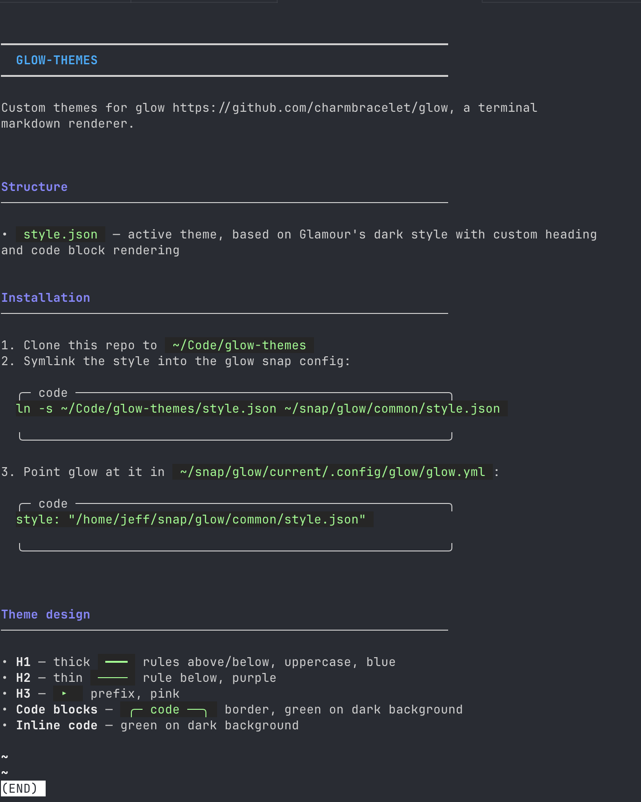

# glow-themes

Custom themes for [glow](https://github.com/charmbracelet/glow), a terminal markdown renderer.

## Theme

`style.json` is the active theme — based on Glamour's dark style with custom heading and code block rendering:

- **H1** — thick `━━━` rules above/below, uppercase, blue
- **H2** — thin `────` rule below, purple
- **H3** — `▸ ` prefix, pink
- **Code blocks** — `╭─ code ──╮` border, green on dark background
- **Inline code** — green on dark background



## Installation

See [CLAUDE.md](CLAUDE.md) for full installation instructions.

## Skills

The [`skills/`](skills/) directory contains AI coding agent skills that live in this repo. Skills are organized by agent framework and symlinked into the appropriate config directory.

### Claude Code

Skills in [`skills/`](skills/) are symlinked into `~/.claude/skills/`:

| Skill | Description |
|-------|-------------|
| [`cmux-doc-glowup`](skills/cmux-doc-glowup/SKILL.md) | Open a markdown file in a new named cmux tab using `glow -p` |

To install the skill (assuming the repo is under ~/Code):
```bash
ln -s ~/Code/glow-themes/skills/cmux-doc-glowup ~/.claude/skills/cmux-doc-glowup
```
